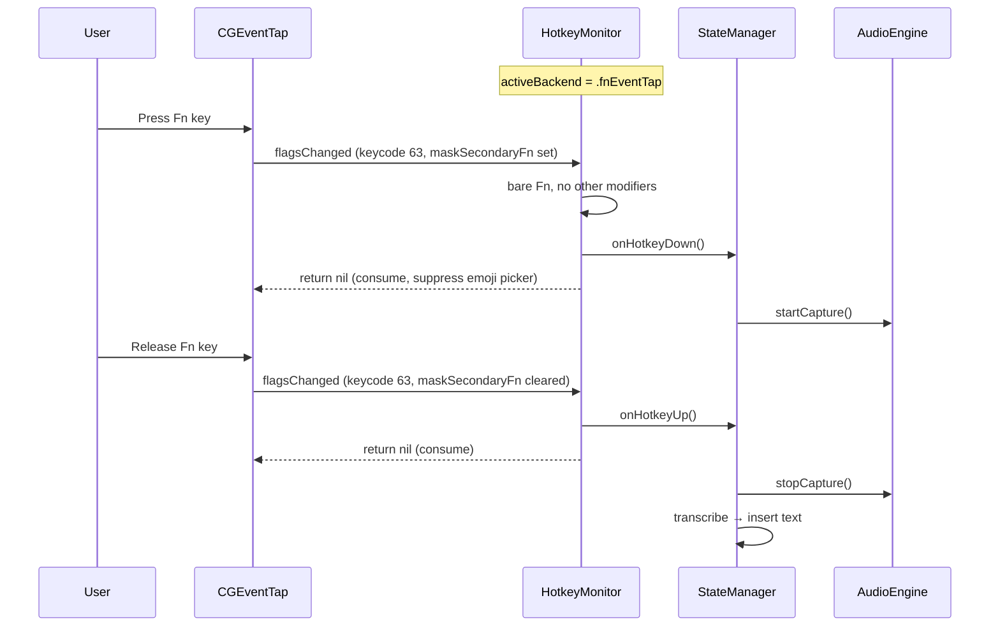

# Design Document: Fn Key as Hotkey (Issue #35)

## Overview

Add support for the Fn (Globe) key as a dictation hotkey by extending the existing `HotkeyMonitor` with an internal CGEventTap path. From the user's perspective, Fn is just another key you can press in the hotkey recorder. From the app's perspective, `HotkeyMonitor` is the only class to interact with — it picks the right mechanism (Carbon or CGEventTap) based on the registered keycode.

## Background: Why Fn Needs Special Handling

- Carbon's `RegisterEventHotKey` only supports Cmd, Opt, Ctrl, Shift as modifiers. Fn is invisible to this API.
- On Apple Silicon Macs, Fn doubles as the Globe key (default: opens emoji picker).
- `kVK_Function` (keycode 63) can only be intercepted via `CGEventTap` at the session level.
- SwiftUI's `.onKeyPress` does not receive Fn/Globe events, so the recorder needs `NSEvent.addLocalMonitorForEvents`.

## Key Design Decision: One Monitor, Two Backends

Instead of two separate monitor classes, `HotkeyMonitor` gains internal branching:

```
HotkeyMonitor.register(keyCode:modifiers:)
    │
    ├─ keyCode == 63 && modifiers == 0
    │   → setupFnEventTap()
    │
    └─ anything else
        → RegisterEventHotKey() (existing Carbon path)
```

**Why this is better than two classes:**
- `StateManager`, `wisprApp`, and settings observation code require zero changes
- No "which monitor is active" state to manage at the app level
- `updateHotkey()` seamlessly switches between Carbon ↔ CGEventTap
- `unregister()` / `deinit` clean up whichever is active
- The Fn key is just a hotkey with keycode 63 — no special "mode" concept

## Architecture

### HotkeyMonitor Changes

```swift
@MainActor
final class HotkeyMonitor {
    // Existing public API — unchanged
    var onHotkeyDown: (() -> Void)?
    var onHotkeyUp: (() -> Void)?
    func register(keyCode: UInt32, modifiers: UInt32) throws
    func unregister()
    func updateHotkey(keyCode: UInt32, modifiers: UInt32) throws
    func verifyRegistration() -> Bool
    func reregisterAfterWake()

    // New: which backend is active
    private enum ActiveBackend {
        case none
        case carbon(hotkeyRef: EventHotKeyRef, handlerRef: EventHandlerRef)
        case fnEventTap(machPort: CFMachPort, runLoopSource: CFRunLoopSource)
    }
    private var activeBackend: ActiveBackend = .none

    // New: Fn-specific state (regular @MainActor-isolated — accessed via
    // MainActor.assumeIsolated in the CGEventTap callback)
    private var fnIsDown = false
    private var tapReEnableAttempts = 0
    private let maxTapReEnableAttempts = 3

    // Sentinel for Fn key
    static let fnKeyCode: UInt32 = 63  // kVK_Function

    // New private methods
    private func setupFnEventTap() throws
    private func teardownFnEventTap()
    private func handleFnFlagsChanged(_ event: CGEvent) -> CGEvent?
}
```

### register() Branching Logic

```swift
func register(keyCode: UInt32, modifiers: UInt32) throws {
    unregister()

    // Check reserved shortcuts (existing)
    ...

    if keyCode == Self.fnKeyCode && modifiers == 0 {
        try setupFnEventTap()
    } else {
        try registerCarbonHotkey(keyCode: keyCode, modifiers: modifiers)
    }

    registeredKeyCode = keyCode
    registeredModifiers = modifiers
}
```

### Actor Isolation: CGEventTap Callback Threading

The CGEventTap callback is a C function pointer — the compiler cannot verify its actor isolation. Since `HotkeyMonitor` is `@MainActor`, we need a way to access isolated state from the callback while returning synchronously (returning `nil` consumes the event to suppress the emoji picker).

**Why not `nonisolated(unsafe)`?** Per Swift 6 concurrency guidance, `nonisolated(unsafe)` is a last resort that disables compiler safety checks entirely and requires a documented invariant + follow-up ticket. We can do better.

**Solution: `MainActor.assumeIsolated`** inside the callback. The event tap's run loop source is added to `CFRunLoopGetMain()`, so the callback always executes on the main thread. `MainActor.assumeIsolated` validates this at runtime (crashes if wrong — a safe fail-fast) and gives us full access to isolated state without opting out of the type system.

This keeps all fields (`fnIsDown`, `onHotkeyDown`, `onHotkeyUp`, `tapReEnableAttempts`) as regular `@MainActor`-isolated properties — no `nonisolated(unsafe)` needed.

> **Note:** The existing Carbon path also calls `handleCarbonEvent` from a C callback via `Unmanaged`. That works today because C function pointer types bypass actor isolation checks in the compiler. The `MainActor.assumeIsolated` approach is strictly better — it adds a runtime assertion that the invariant holds.

### CGEventTap Implementation

```swift
private func setupFnEventTap() throws {
    let eventMask = CGEventMask(1 << CGEventType.flagsChanged.rawValue)

    // C callback — runs on main run loop. Uses MainActor.assumeIsolated
    // to re-enter actor isolation with a runtime check.
    let callback: CGEventTapCallBack = { proxy, type, event, userInfo in
        guard let userInfo else { return Unmanaged.passUnretained(event) }

        return MainActor.assumeIsolated {
            let monitor = Unmanaged<HotkeyMonitor>.fromOpaque(userInfo)
                .takeUnretainedValue()

            if type == .tapDisabledByTimeout || type == .tapDisabledByUserInput {
                monitor.tapReEnableAttempts += 1
                if monitor.tapReEnableAttempts <= monitor.maxTapReEnableAttempts {
                    if case .fnEventTap(let port, _) = monitor.activeBackend {
                        CGEvent.tapEnable(tap: port, enable: true)
                    }
                }
                return Unmanaged.passUnretained(event)
            }

            // Reset re-enable counter on successful callback
            monitor.tapReEnableAttempts = 0

            if let result = monitor.handleFnFlagsChanged(event) {
                return Unmanaged.passUnretained(result)
            }
            return nil  // consume the event
        }
    }

    let selfPtr = Unmanaged.passUnretained(self).toOpaque()

    guard let tap = CGEvent.tapCreate(
        tap: .cgSessionEventTap,
        place: .headInsertEventTap,
        options: .defaultTap,
        eventsOfInterest: eventMask,
        callback: callback,
        userInfo: selfPtr
    ) else {
        throw WisprError.hotkeyRegistrationFailed
    }

    let source = CFMachPortCreateRunLoopSource(nil, tap, 0)
    CFRunLoopAddSource(CFRunLoopGetMain(), source, .commonModes)
    CGEvent.tapEnable(tap: tap, enable: true)

    activeBackend = .fnEventTap(machPort: tap, runLoopSource: source!)
}
```

### Fn Event Filtering

```swift
/// Called from within MainActor.assumeIsolated in the CGEventTap callback.
/// Regular @MainActor-isolated method — full access to all instance state.
private func handleFnFlagsChanged(_ event: CGEvent) -> Unmanaged<CGEvent>? {
    let keycode = event.getIntegerValueField(.keyboardEventKeycode)
    guard keycode == Int64(Self.fnKeyCode) else {
        return Unmanaged.passUnretained(event)  // not Fn, pass through
    }

    let flags = event.flags

    // Pass through if other modifiers are held (Fn+Cmd, Fn+Opt, etc.)
    let otherModifiers: CGEventFlags = [.maskCommand, .maskAlternate, .maskControl, .maskShift]
    if !flags.intersection(otherModifiers).isEmpty {
        return Unmanaged.passUnretained(event)
    }

    let isFnDown = flags.contains(.maskSecondaryFn)

    if isFnDown && !fnIsDown {
        fnIsDown = true
        onHotkeyDown?()
        return nil  // consume — suppress emoji picker
    } else if !isFnDown && fnIsDown {
        fnIsDown = false
        onHotkeyUp?()
        return nil  // consume
    }

    return Unmanaged.passUnretained(event)
}
```

### unregister() Cleanup

```swift
func unregister() {
    switch activeBackend {
    case .carbon(let hotkeyRef, let handlerRef):
        UnregisterEventHotKey(hotkeyRef)
        RemoveEventHandler(handlerRef)
    case .fnEventTap(let machPort, let runLoopSource):
        CGEvent.tapEnable(tap: machPort, enable: false)
        CFRunLoopRemoveSource(CFRunLoopGetMain(), runLoopSource, .commonModes)
        CFMachPortInvalidate(machPort)
    case .none:
        break
    }
    activeBackend = .none
    fnIsDown = false
    tapReEnableAttempts = 0
    registeredKeyCode = 0
    registeredModifiers = 0
}
```

### Wake Re-registration

The existing `handleSystemWake()` calls `verifyRegistration()` which calls `unregister()` + `register()`. This naturally works for both backends — if the Fn event tap went stale after sleep, it gets torn down and recreated.

### KeyCodeMapping Changes

```swift
// Add to keyNames
63: "🌐 Fn",

// No charToKeyCode entry needed — Fn is captured via NSEvent monitor,
// not SwiftUI .onKeyPress
```

### HotkeyRecorderView Changes

SwiftUI's `.onKeyPress` never fires for Fn/Globe. The recorder needs an `NSEvent` local monitor to detect it:

```swift
struct HotkeyRecorderView: View {
    // ... existing properties ...
    @State private var fnMonitor: Any?

    var body: some View {
        // ... existing body ...
        .onChange(of: isRecording) { _, recording in
            if recording {
                installFnMonitor()
            } else {
                removeFnMonitor()
            }
        }
    }

    private func installFnMonitor() {
        fnMonitor = NSEvent.addLocalMonitorForEvents(matching: .flagsChanged) { event in
            guard isRecording else { return event }

            // Pass through if other modifiers are held (Fn+Cmd, Fn+Opt, etc.)
            let otherModifiers: NSEvent.ModifierFlags = [.command, .option, .control, .shift]
            if !event.modifierFlags.intersection(otherModifiers).isEmpty {
                return event
            }

            // Detect Fn via the .function modifier flag rather than keyCode,
            // because Apple Silicon Macs may report a keycode other than 63.
            if event.modifierFlags.contains(.function) {
                keyCode = UInt32(HotkeyMonitor.fnKeyCode)
                modifiers = 0
                isRecording = false
                errorMessage = nil
                return nil  // consume
            }
            return event
        }
    }

    private func removeFnMonitor() {
        if let monitor = fnMonitor {
            NSEvent.removeMonitor(monitor)
            fnMonitor = nil
        }
    }
}
```

The existing `handleKeyPress()` modifier guard (`carbonModifiers != 0`) stays unchanged — Fn is handled by the NSEvent monitor above, not by `.onKeyPress`, so it never reaches `handleKeyPress()`.

### Settings View: Globe Key Conflict Warning

When the hotkey is configured as Fn (keyCode 63, modifiers 0), the Settings view shows a static informational warning about potential Globe key conflicts. The app does not attempt to read `AppleFnUsageType` from system defaults — on macOS 26 this value is unreliable (returns stale data).

```swift
// In SettingsView, below the hotkey recorder
if settingsStore.hotkeyKeyCode == HotkeyMonitor.fnKeyCode
    && settingsStore.hotkeyModifiers == 0 {
    Label {
        Text("The Globe key may conflict with macOS features like the emoji picker or input source switching. If dictation doesn't start, go to System Settings → Keyboard → \"Press 🌐 key to\" and select \"Do Nothing\".")
    } icon: {
        Image(systemName: SFSymbols.info)
            .foregroundStyle(.blue)
    }
    .font(.caption)
}
```

## Data Flow: Fn Key Recording Session



## Files to Modify

| File | Change |
|------|--------|
| `wispr/Services/HotkeyMonitor.swift` | Add `ActiveBackend` enum, CGEventTap setup/teardown, Fn event handling |
| `wispr/UI/Settings/KeyCodeMapping.swift` | Add keycode 63 → "🌐 Fn" to `keyNames` |
| `wispr/UI/Settings/HotkeyRecorderView.swift` | Add `NSEvent.addLocalMonitorForEvents` for Fn detection during recording |
| `wispr/UI/Settings/SettingsView.swift` | Add Globe key conflict warning (contextual, below hotkey recorder) |
| `wisprTests/HotkeyMonitorTests.swift` | Add tests for Fn registration path, backend switching |

No new files needed. No changes to `StateManager`, `wisprApp`, or `SettingsStore`.

## Risks and Mitigations

| Risk | Likelihood | Mitigation |
|------|-----------|------------|
| Emoji picker still opens despite consuming event | Low | Consume both press and release; test on Apple Silicon hardware |
| Event tap disabled by system timeout | Low | Callback is lightweight (flag check + closure call); auto re-enable |
| Fn+F-key combos broken | Medium if filter is wrong | Only consume when keycode == 63 AND no other modifiers held |
| NSEvent monitor in recorder misses Fn | Low | `.flagsChanged` reliably includes Fn; tested on macOS 26 |
| Switching Carbon ↔ CGEventTap on updateHotkey | Low | `unregister()` cleans up whichever is active before `register()` |
