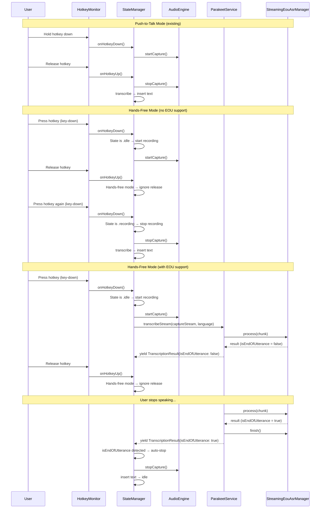

# Design Document: Hands-Free Dictation

## Overview

Add a toggle-based "hands-free" dictation mode to Wispr as an alternative to the existing push-to-talk (hold-to-record) behavior. In hands-free mode, the user presses the hotkey once to start recording and presses it again to stop, eliminating the need to hold the key down during long dictation sessions.

Additionally, when the active transcription model supports end-of-utterance (EOU) detection (e.g., NVIDIA's Parakeet EOU 120M), hands-free mode can automatically stop recording when the model detects the user has finished speaking — no second hotkey press needed. This is achieved through the existing `transcribeStream` protocol method and a new `isEndOfUtterance` flag on `TranscriptionResult`: the EOU-capable engine's `transcribeStreamWithEou` processes audio chunks via `StreamingEouAsrManager.process()`, and when the manager signals end-of-utterance, the engine yields a `TranscriptionResult` with `isEndOfUtterance: true`. The StateManager monitors the stream and reacts to that flag by auto-stopping recording.

## Main Algorithm/Workflow



## Core Interfaces/Types

```swift
// New property on SettingsStore — persisted via UserDefaults
@MainActor
@Observable
final class SettingsStore {
    // ... existing properties ...

    /// When true, hotkey toggles recording on/off (press once to start, press again to stop).
    /// When false, uses push-to-talk (hold to record, release to stop).
    var handsFreeMode: Bool {
        didSet { save() }
    }
}
```

```swift
/// TranscriptionResult — add isEndOfUtterance flag.
///
/// Defaults to false so all existing call sites are unaffected.
/// Only the EOU-capable engine (ParakeetService with EOU model) sets it to true
/// when StreamingEouAsrManager detects end-of-utterance.
struct TranscriptionResult: Sendable, Equatable {
    let text: String
    let detectedLanguage: String?
    let duration: TimeInterval
    /// True when the transcription engine detected end-of-utterance.
    /// Used by StateManager to auto-stop recording in hands-free mode.
    let isEndOfUtterance: Bool

    init(text: String, detectedLanguage: String? = nil, duration: TimeInterval, isEndOfUtterance: Bool = false) {
        self.text = text
        self.detectedLanguage = detectedLanguage
        self.duration = duration
        self.isEndOfUtterance = isEndOfUtterance
    }
}
```

```swift
// No changes to AppStateType — the existing states are sufficient.
// .idle → .recording → .processing → .idle still applies.
// The difference is purely in how hotkey events drive state transitions.
enum AppStateType: Sendable, Equatable, CustomStringConvertible {
    case loading
    case idle
    case recording   // Used by both push-to-talk and hands-free
    case processing
    case error(String)
}
```

```swift
/// TranscriptionEngine protocol — EOU capability query as a REQUIRED method.
///
/// Every engine must explicitly declare whether it supports end-of-utterance
/// detection. There is NO default implementation — each conforming type
/// must provide its own.
///
/// No new streaming method is needed. The existing transcribeStream() already
/// accepts an audio stream and yields partial results. An EOU-capable engine
/// simply finishes its output stream when it detects end-of-utterance.
/// A non-EOU engine only finishes when the input audio stream ends (i.e.,
/// when the user manually stops recording).
protocol TranscriptionEngine: Actor {
    // ... existing methods (unchanged) ...

    func transcribeStream(
        _ audioStream: AsyncStream<[Float]>,
        language: TranscriptionLanguage
    ) async -> AsyncThrowingStream<TranscriptionResult, Error>

    /// Whether the currently loaded model supports end-of-utterance detection.
    /// When true, transcribeStream() will finish its output when the user
    /// stops speaking. When false, transcribeStream() only finishes when
    /// the input audio stream ends.
    ///
    /// REQUIRED — no default implementation. Each engine must explicitly
    /// return the correct value.
    func supportsEndOfUtteranceDetection() async -> Bool
}
```

## Key Functions with Formal Specifications

### Function 1: StateManager.setupHotkeyCallbacks()

```swift
private func setupHotkeyCallbacks() {
    hotkeyMonitor.onHotkeyDown = { [weak self] in
        guard let self else { return }
        Task { @MainActor in
            if self.settingsStore.handsFreeMode {
                await self.toggleRecording()
            } else {
                await self.beginRecording()
            }
        }
    }

    hotkeyMonitor.onHotkeyUp = { [weak self] in
        guard let self else { return }
        Task { @MainActor in
            if !self.settingsStore.handsFreeMode {
                await self.endRecording()
            }
            // In hands-free mode, key-up is intentionally ignored.
        }
    }
}
```

**Preconditions:**
- `hotkeyMonitor` is initialized and registered
- `settingsStore` is initialized with a valid `handsFreeMode` value

**Postconditions:**
- `onHotkeyDown` closure is set: dispatches to `toggleRecording()` if hands-free, `beginRecording()` otherwise
- `onHotkeyUp` closure is set: dispatches to `endRecording()` only if push-to-talk mode
- In hands-free mode, `onHotkeyUp` is a no-op (does not trigger `endRecording()`)

**Loop Invariants:** N/A

---

### Function 2: StateManager.toggleRecording()

```swift
/// Toggles recording state for hands-free mode.
/// If idle, starts recording (with EOU monitoring when supported).
/// If recording, stops recording.
/// Ignores calls during .loading, .processing, or .error states.
func toggleRecording() async {
    switch appState {
    case .idle:
        await beginRecording()
        // After recording starts, check if EOU monitoring should be enabled
        if appState == .recording {
            await startEouMonitoringIfSupported()
        }
    case .recording:
        cancelEouMonitoring()
        await endRecording()
    case .loading, .processing, .error:
        // Ignore toggle during non-actionable states
        break
    }
}
```

**Preconditions:**
- Called only when `settingsStore.handsFreeMode == true`
- `appState` is one of the defined `AppStateType` cases

**Postconditions:**
- If `appState` was `.idle`: transitions to `.recording` (delegates to `beginRecording()`), then starts EOU monitoring if the active engine supports it
- If `appState` was `.recording`: cancels any active EOU monitoring, then transitions to `.processing` then `.idle` (delegates to `endRecording()`)
- If `appState` was `.loading`, `.processing`, or `.error`: no state change occurs
- No new state values are introduced; reuses existing `beginRecording()` and `endRecording()`

**Loop Invariants:** N/A

---

### Function 3: StateManager.startEouMonitoringIfSupported()

```swift
/// Checks if the active transcription engine supports EOU detection
/// and, if so, starts a background task that uses the existing
/// transcribeStream() to monitor for end-of-utterance.
///
/// The key insight: transcribeStream() already feeds audio to the engine.
/// For an EOU-capable engine (ParakeetService with EOU model), the
/// underlying transcribeStreamWithEou() checks result.isEndOfUtterance
/// after each manager.process() call. When EOU is detected, it calls
/// manager.finish(), yields the final result, and finishes the stream.
///
/// This task simply consumes that stream. When the stream finishes,
/// EOU has been detected and recording auto-stops.
/// No secondary audio stream tap needed — reuses the existing capture stream.
private func startEouMonitoringIfSupported() async {
    let supportsEou = await whisperService.supportsEndOfUtteranceDetection()
    guard supportsEou else { return }

    eouMonitoringTask = Task { @MainActor [weak self] in
        guard let self else { return }
        do {
            // Reuse the same audio stream that's already being captured.
            // transcribeStream feeds it to the EOU engine, which auto-finishes
            // when it detects end-of-utterance.
            let resultStream = await self.whisperService.transcribeStream(
                self.audioEngine.captureStream,
                language: self.currentLanguage
            )

            // Consume partial results. When a result has isEndOfUtterance == true,
            // the engine detected end-of-utterance — auto-stop recording.
            var finalResult: TranscriptionResult?
            for try await result in resultStream {
                if result.isEndOfUtterance {
                    finalResult = result
                    break
                }
            }

            // EOU detected via the flag. Auto-stop recording.
            guard let finalResult, !Task.isCancelled, self.appState == .recording else { return }

            _ = await self.audioEngine.stopCapture()
            self.audioLevelStream = nil
            self.appState = .processing

            NSAccessibility.post(
                element: NSApp as Any,
                notification: .announcementRequested,
                userInfo: [.announcement: "Speech ended, processing"]
            )

            guard !finalResult.text.isEmpty else {
                await self.resetToIdle()
                return
            }

            do {
                try await self.textInsertionService.insertText(finalResult.text)
                NSAccessibility.post(
                    element: NSApp as Any,
                    notification: .announcementRequested,
                    userInfo: [.announcement: "Text inserted"]
                )
                await self.resetToIdle()
            } catch {
                await self.handleError(
                    .textInsertionFailed(
                        "Text insertion failed. The transcribed text has been copied to your clipboard."
                    )
                )
            }
        } catch {
            guard !Task.isCancelled else { return }
            // EOU monitoring failed — fall back to manual toggle behavior.
            // Recording continues; user can still press hotkey to stop.
            Log.stateManager.warning("EOU monitoring failed: \(error.localizedDescription)")
        }
    }
}
```

**Preconditions:**
- `appState == .recording`
- `settingsStore.handsFreeMode == true`
- Audio capture is active (`audioEngine.captureStream` is available)

**Postconditions:**
- If engine supports EOU: `eouMonitoringTask` is set, consuming the `transcribeStream` output in the background
- If engine does not support EOU: returns immediately, no task created (falls back to manual toggle)
- On EOU detection (`result.isEndOfUtterance == true`): recording stops, transcription result is inserted, state returns to `.idle`
- On monitoring failure: recording continues uninterrupted, user can still manually toggle off
- Task is cancellable (cancelled when user manually stops recording)
- No secondary audio stream tap needed — reuses the existing capture stream

**Loop Invariants:** N/A

---

### Function 4: StateManager.cancelEouMonitoring()

```swift
/// Cancels any active EOU monitoring task.
/// Called when the user manually stops recording via hotkey toggle.
private func cancelEouMonitoring() {
    eouMonitoringTask?.cancel()
    eouMonitoringTask = nil
}
```

**Preconditions:**
- May be called regardless of whether EOU monitoring is active (safe no-op if nil)

**Postconditions:**
- `eouMonitoringTask` is cancelled and set to nil
- The transcribeStream consumption is terminated via task cancellation

---

### Function 5: WhisperService.supportsEndOfUtteranceDetection()

```swift
// In WhisperService — EOU is never supported
func supportsEndOfUtteranceDetection() async -> Bool {
    return false
}
```

**Preconditions:**
- Actor-isolated, safe to access internal state

**Postconditions:**
- Always returns `false` — Whisper models do not support EOU detection

---

### Function 6: ParakeetService.supportsEndOfUtteranceDetection()

```swift
// In ParakeetService — EOU capability query
func supportsEndOfUtteranceDetection() async -> Bool {
    // Only the Parakeet EOU model supports end-of-utterance detection.
    // Requires both the correct model AND an initialized EOU manager.
    return activeModelName == ModelInfo.KnownID.parakeetEou && eouManager != nil
}
```

**Preconditions:**
- Actor-isolated, safe to access internal state

**Postconditions:**
- Returns `true` only when the Parakeet EOU model is actively loaded AND the EOU manager is initialized
- Returns `false` for Parakeet V3 or when no model is loaded

---

### Function 7: CompositeTranscriptionEngine.supportsEndOfUtteranceDetection()

```swift
// In CompositeTranscriptionEngine — forward EOU capability query to active engine
func supportsEndOfUtteranceDetection() async -> Bool {
    guard let idx = activeEngineIndex else { return false }
    return await engines[idx].supportsEndOfUtteranceDetection()
}

// Note: transcribeStream() is already forwarded by the existing implementation.
// No additional forwarding is needed for EOU support.
```

**Preconditions:**
- `activeEngineIndex` may or may not be set

**Postconditions:**
- Delegates to the active engine's `supportsEndOfUtteranceDetection()`
- Returns `false` if no engine is active

---

### Function 8: ParakeetService.transcribeStreamWithEou() — updated for EOU auto-finish

```swift
/// Updated to detect EOU via result.isEndOfUtterance after each
/// manager.process() call. When EOU is detected, calls manager.finish(),
/// yields the final result, and finishes the stream.
///
/// This is the key change: the existing transcribeStreamWithEou already
/// processes chunks via manager.process(). We just need to check the
/// return value's isEndOfUtterance flag and react accordingly.
private func transcribeStreamWithEou(
    _ audioStream: AsyncStream<[Float]>
) -> AsyncThrowingStream<TranscriptionResult, Error> {
    AsyncThrowingStream { continuation in
        Task {
            guard let manager = self.eouManager else {
                continuation.finish(throwing: TranscriptionError.modelNotLoaded)
                return
            }

            do {
                var eouDetected = false
                for await chunk in audioStream {
                    let result = try manager.process(chunk)
                    eouDetected = result.isEndOfUtterance
                    if eouDetected { break }
                }

                let text = try manager.finish()
                continuation.yield(TranscriptionResult(
                    text: text,
                    detectedLanguage: nil,
                    duration: 0,
                    isEndOfUtterance: eouDetected
                ))
                continuation.finish()
            } catch {
                continuation.finish(throwing: error)
            }
        }
    }
}
```

**Preconditions:**
- `eouManager` is initialized (Parakeet EOU model is loaded)
- `audioStream` is an active stream of audio chunks

**Postconditions:**
- Yields partial `TranscriptionResult` (with `isEndOfUtterance: false`) after each `manager.process()` call
- If `result.isEndOfUtterance == true`: calls `manager.finish()`, yields final result with `isEndOfUtterance: true`, finishes stream
- If audio stream ends naturally (manual stop): calls `manager.finish()`, yields final result with `isEndOfUtterance: false`, finishes stream
- On error: finishes stream with the error
- The `isEndOfUtterance` flag on `TranscriptionResult` is the explicit signal to the StateManager

**Loop Invariants:**
- Each chunk is processed exactly once via `manager.process()`
- `isEndOfUtterance` is checked after every chunk — early exit on first detection

---

### Function 9: SettingsStore persistence for handsFreeMode

```swift
// In SettingsStore — additions only

private enum Keys {
    // ... existing keys ...
    static let handsFreeMode = "handsFreeMode"
}

// In init — default value
self.handsFreeMode = false

// In save()
defaults.set(handsFreeMode, forKey: Keys.handsFreeMode)

// In load()
if defaults.object(forKey: Keys.handsFreeMode) != nil {
    self.handsFreeMode = defaults.bool(forKey: Keys.handsFreeMode)
}
```

**Preconditions:**
- `UserDefaults.standard` is accessible
- `isLoading` guard prevents save during load

**Postconditions:**
- `handsFreeMode` defaults to `false` (push-to-talk) on fresh install
- Value persists across app launches via UserDefaults
- `didSet` triggers `save()` on every change (guarded by `isLoading`)

---

### Function 10: SettingsView toggle for hands-free mode

```swift
// In SettingsView, inside the hotkeySection
@Bindable var store = settingsStore
Toggle("Hands-Free Mode", isOn: $store.handsFreeMode)
    .accessibilityHint(
        "When enabled, press the hotkey once to start recording and again to stop. " +
        "When disabled, hold the hotkey to record."
    )
```

**Preconditions:**
- `settingsStore` is available in the SwiftUI environment
- `hotkeySection` is rendered in the settings form

**Postconditions:**
- Toggle reflects current `handsFreeMode` value
- Toggling updates `settingsStore.handsFreeMode` which triggers persistence
- Accessibility hint describes both modes clearly

---

### Function 11: RecordingOverlayView accessibility hint update

```swift
// Update the accessibility hint to reflect the current mode
.accessibilityHint(
    settingsStore.handsFreeMode
        ? "Press the hotkey again to stop recording, or wait for auto-stop"
        : "Release the hotkey to stop recording"
)
```

**Preconditions:**
- `stateManager` and `settingsStore` are available in the environment
- Overlay is visible (app is in `.recording` state)

**Postconditions:**
- Accessibility hint accurately describes how to stop recording for the active mode
- VoiceOver users receive correct instructions

---

### Function 12: restoreDefaults() update

```swift
// In SettingsView.restoreDefaults()
settingsStore.handsFreeMode = false
```

**Preconditions:**
- User confirmed the "Restore Defaults" alert

**Postconditions:**
- `handsFreeMode` is reset to `false` (push-to-talk is the default)
- Consistent with all other settings being restored to defaults

## Algorithmic Summary

The pseudocode sections are omitted — all algorithms are expressed as Swift in the Key Functions above (Functions 1–8). The sequence diagram in the Main Algorithm/Workflow section provides the visual overview of all three modes.

## Example Usage

```swift
// Example 1: User enables hands-free mode in settings
settingsStore.handsFreeMode = true
// Now hotkey behavior changes immediately — no restart needed

// Example 2: Hands-free recording with EOU-capable model (Parakeet EOU 120M)
// User presses Option+Space (key-down event fires)
// → toggleRecording() called → appState is .idle → beginRecording()
// → appState transitions to .recording, audio capture starts
// → startEouMonitoringIfSupported() called
// → engine.supportsEndOfUtteranceDetection() returns true (parakeetEou model + eouManager != nil)
// → background task calls transcribeStream(audioEngine.captureStream, language)
// → transcribeStream delegates to transcribeStreamWithEou internally
// → transcribeStreamWithEou processes each chunk via manager.process()
// User releases Option+Space (key-up event fires)
// → hands-free mode → onHotkeyUp is no-op, recording continues

// User dictates: "Send an email to the team about the release"
// User stops speaking... silence detected by EOU model
// → manager.process(chunk) returns result with isEndOfUtterance = true
// → transcribeStreamWithEou calls manager.finish(), yields final result, finishes stream
// → background task sees stream end, auto-calls stopCapture(), inserts text
// → appState transitions to .idle — no second hotkey press needed

// Example 3: Hands-free recording WITHOUT EOU support (Whisper, Parakeet V3)
// User presses Option+Space (key-down event fires)
// → toggleRecording() called → appState is .idle → beginRecording()
// → startEouMonitoringIfSupported() called
// → engine.supportsEndOfUtteranceDetection() returns false (WhisperService always returns false)
// → no EOU task created, falls back to manual toggle
// User presses Option+Space again to stop

// Example 4: User manually stops during EOU monitoring
// EOU monitoring is active, but user presses hotkey to stop early
// → toggleRecording() called → appState is .recording
// → cancelEouMonitoring() cancels the background task
// → endRecording() stops capture and transcribes normally

// Example 5: EOU monitoring fails gracefully
// transcribeStream throws an error during monitoring
// → background task catches error, logs warning
// → recording continues — user can still press hotkey to stop

// Example 6: Mode switch during idle
settingsStore.handsFreeMode = false
// Immediately reverts to push-to-talk behavior

// Example 7: Toggle during processing is safely ignored
// appState == .processing
// User presses hotkey → toggleRecording() → .processing case → no-op

// Example 8: Restore defaults resets to push-to-talk
restoreDefaults()
assert(settingsStore.handsFreeMode == false)

// Example 9: supportsEndOfUtteranceDetection is explicit per engine
// WhisperService: always returns false
// ParakeetService: returns true only when activeModelName == .parakeetEou && eouManager != nil
// CompositeTranscriptionEngine: forwards to the active engine
```
