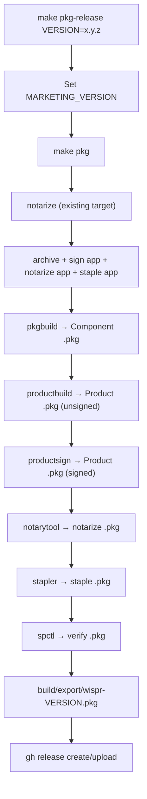

# Design Document: pkg-installer

## Overview

This feature adds a `.pkg` installer distribution channel for Wispr. The implementation extends the existing Makefile build pipeline with two new targets (`pkg` and `pkg-release`) that chain into the existing `notarize` target to avoid duplicating archive, signing, or notarization logic.

The flow is: `notarize` (existing) → `pkgbuild` → `productbuild` → `productsign` → `notarytool` → `stapler`. The final artifact is a signed, notarized `.pkg` with a custom installer UI (branded background, welcome, readme, license screens) that installs Wispr.app to `/Applications`.

All installer resources live in `pkg/resources/` and the distribution XML at `pkg/distribution.xml`, both version-controlled. The `installer_identity` (Developer ID Installer certificate name) is read from the existing `secrets/notarization.json`.

## Architecture

The design maximizes reuse of the existing Makefile infrastructure. No new scripts or build tools are introduced — everything is standard Apple command-line tools (`pkgbuild`, `productbuild`, `productsign`, `notarytool`, `stapler`, `spctl`) invoked from Make.

### Build Flow



### Target Dependency Chain

```
pkg-release
  └── pkg
        └── notarize (existing)
              └── archive (existing)
                    └── bump-build (existing)
              └── _setup-api-key (existing)
```

The `pkg` target calls `notarize` as a prerequisite, then runs the pkg-specific steps. The `pkg-release` target sets the version, calls `pkg`, then uploads to GitHub Releases. This mirrors the `brew-release` pattern already in the Makefile.

## Components and Interfaces

### New Makefile Variables

| Variable | Source | Value |
|----------|--------|-------|
| `INSTALLER_IDENTITY` | `secrets/notarization.json` → `.installer_identity` | Developer ID Installer certificate name |
| `COMPONENT_PKG` | Derived | `$(EXPORT_DIR)/wispr-component.pkg` |
| `PRODUCT_PKG` | Derived | `$(EXPORT_DIR)/wispr-unsigned.pkg` |
| `SIGNED_PKG` | Derived | `$(EXPORT_DIR)/wispr-signed.pkg` |
| `FINAL_PKG` | Derived | `$(EXPORT_DIR)/wispr-$(VERSION).pkg` |
| `PKG_RESOURCES` | Static | `$(CURDIR)/pkg/resources` |
| `DISTRIBUTION_XML` | Static | `$(CURDIR)/pkg/distribution.xml` |

All existing variables (`BUNDLE_ID`, `SIGNING_IDENTITY`, `APP_PATH`, `EXPORT_DIR`, `ARCHIVE_PATH`, `API_KEY_PATH`, `API_KEY_ID`, `API_ISSUER`, `NOTARIZATION_JSON`) are reused as-is.

### New Makefile Targets

#### `pkg` target

Orchestrates the full `.pkg` build pipeline:

1. Depends on `notarize` — produces the signed, notarized `Wispr.app` at `$(APP_PATH)`
2. Reads `INSTALLER_IDENTITY` from `$(NOTARIZATION_JSON)`
3. Validates `INSTALLER_IDENTITY` is non-empty
4. Extracts `VERSION` from the Xcode project's `MARKETING_VERSION` (if not provided)
5. Runs `pkgbuild` to create the component package
6. Runs `productbuild` to create the product package with custom UI
7. Runs `productsign` to sign the product package
8. Runs `notarytool` to notarize the signed package (reuses `_setup-api-key` / `_cleanup-api-key`)
9. Runs `stapler` to staple the notarization ticket
10. Runs `spctl` to verify
11. Renames to final `wispr-<VERSION>.pkg`
12. Prints summary with path

#### `pkg-release` target

Mirrors `brew-release` pattern:

1. Validates `VERSION` parameter is provided
2. Validates `gh` CLI is installed
3. Sets `MARKETING_VERSION` in the Xcode project via `sed`
4. Calls `make pkg`
5. Creates/updates GitHub Release tagged `v<VERSION>`
6. Uploads `.pkg` as release asset (alongside existing assets)

### Command-Line Tool Usage

| Step | Tool | Key Arguments |
|------|------|---------------|
| Component pkg | `pkgbuild` | `--root` (app path parent), `--component-plist` (not needed, single app), `--install-location /Applications`, `--identifier $(BUNDLE_ID)`, `--version $(VERSION)` |
| Product pkg | `productbuild` | `--distribution $(DISTRIBUTION_XML)`, `--resources $(PKG_RESOURCES)`, `--package-path $(EXPORT_DIR)` |
| Sign pkg | `productsign` | `--sign "$(INSTALLER_IDENTITY)"` |
| Notarize pkg | `notarytool` | `--key`, `--key-id`, `--issuer`, `--wait` |
| Staple pkg | `stapler` | `staple` |
| Verify pkg | `spctl` | `-a -vvv -t install` |

### File Layout

```
repo/
├── pkg/
│   ├── distribution.xml          # Installer flow definition
│   └── resources/
│       ├── background.png        # Branded installer background
│       ├── welcome.html          # Welcome screen content
│       ├── readme.html           # System requirements & post-install
│       └── license.txt           # Apache License 2.0 (copy of LICENSE)
├── secrets/
│   └── notarization.json         # Now includes "installer_identity" field
├── Makefile                      # Extended with pkg + pkg-release targets
└── build/
    └── export/
        ├── Wispr.app             # (existing, from notarize target)
        └── wispr-<VERSION>.pkg   # (new, final output)
```

## Data Models

### `secrets/notarization.json` (extended)

```json
{
  "apple_id": "[email]",
  "team_id": "[team_id]",
  "signing_identity": "Developer ID Application: [name] ([team_id])",
  "installer_identity": "Developer ID Installer: [name] ([team_id])"
}
```

The only change is the addition of the `installer_identity` field. All existing fields remain unchanged.

### `pkg/distribution.xml`

```xml
<?xml version="1.0" encoding="utf-8"?>
<installer-gui-script minSpecVersion="2">
    <title>Wispr</title>
    <background file="background.png" alignment="bottomleft" scaling="proportional"/>
    <welcome file="welcome.html"/>
    <readme file="readme.html"/>
    <license file="license.txt"/>
    <options customize="never" require-scripts="false"/>
    <choices-outline>
        <line choice="default">
            <line choice="wispr"/>
        </line>
    </choices-outline>
    <choice id="default"/>
    <choice id="wispr" visible="false">
        <pkg-ref id="com.stormacq.mac.wispr"/>
    </choice>
    <pkg-ref id="com.stormacq.mac.wispr" version="0" onConclusion="none">wispr-component.pkg</pkg-ref>
</installer-gui-script>
```

Key design decisions:
- `customize="never"` — single component, no user choice needed
- `require-scripts="false"` — no pre/post-install scripts per requirements
- The `pkg-ref` version is `0` because the actual version is set in the component package via `pkgbuild --version`
- The `pkg-ref` filename matches the `COMPONENT_PKG` basename

### Installer Resource Files

| File | Format | Content |
|------|--------|---------|
| `background.png` | PNG, ~660×440 | Wispr branding with project color palette |
| `welcome.html` | HTML | Brief intro: what Wispr is, key features, on-device privacy |
| `readme.html` | HTML | System requirements (macOS 15.0+, microphone), post-install steps (grant permissions, download model) |
| `license.txt` | Plain text | Copy of the repo root `LICENSE` file (Apache 2.0) |


## Correctness Properties

*A property is a characteristic or behavior that should hold true across all valid executions of a system — essentially, a formal statement about what the system should do. Properties serve as the bridge between human-readable specifications and machine-verifiable correctness guarantees.*

### Property 1: Installer identity extraction round trip

*For any* valid `notarization.json` file containing an `installer_identity` field with a non-empty string value, reading that field via `jq -r .installer_identity` shall produce the exact string stored in the JSON.

**Validates: Requirements 3.2, 7.2**

### Property 2: Output package filename follows version pattern

*For any* valid semantic version string `X.Y.Z`, the final `.pkg` output filename shall be `wispr-X.Y.Z.pkg` and shall be located in the `build/export/` directory.

**Validates: Requirements 5.2**

### Property 3: Marketing version injection

*For any* valid version string `X.Y.Z`, running the `sed` substitution on a `.pbxproj` file containing `MARKETING_VERSION = <old>;` shall produce a file where all `MARKETING_VERSION` entries equal `X.Y.Z`.

**Validates: Requirements 6.1**

### Property 4: Missing resource file detection

*For any* single file removed from the required set {`background.png`, `welcome.html`, `readme.html`, `license.txt`} in `pkg/resources/`, the build pipeline shall fail with an error message that names the missing file.

**Validates: Requirements 8.4**

## Error Handling

All error handling follows the existing Makefile pattern: print a descriptive message to stderr and `exit 1`. No partial artifacts are left behind on failure.

| Error Condition | Message Pattern | Source Requirement |
|---|---|---|
| `pkgbuild` non-zero exit | `Error: pkgbuild failed` | 1.4 |
| `productbuild` non-zero exit | `Error: productbuild failed` | 2.8 |
| `productsign` non-zero exit | `Error: productsign failed` | 3.4 |
| `installer_identity` missing from JSON | `Error: installer_identity not found in <path>` | 7.3 |
| `installer_identity` not in keychain | `Error: certificate "<name>" not found in keychain` | 3.3 |
| Notarization failure | `Error: notarization failed. Log: <url>` | 4.5 |
| Stapling failure | `Error: stapler failed` | 4.6 |
| Missing resource file | `Error: missing installer resource: <filename>` | 8.4 |
| `VERSION` not provided (pkg-release) | `Usage: make pkg-release VERSION=x.y.z` | 6.5 |
| `gh` CLI not installed | `Error: gh CLI not installed` | 6.6 |

Each tool invocation in the Makefile recipe uses `||` to catch failures:

```makefile
@pkgbuild ... || { echo "Error: pkgbuild failed"; exit 1; }
```

The `_cleanup-api-key` target is called in a trap or final step to ensure the API key file is removed even on failure, matching the existing pattern.

## Testing Strategy

This feature is primarily a Makefile build pipeline — the "code" is shell commands orchestrated by Make. Testing focuses on two layers:

### Unit Tests (Example-Based)

Since the deliverable is a Makefile with shell commands, unit tests verify:

1. **Static file validation**: Parse `pkg/distribution.xml` and verify it contains the required elements (background, welcome, readme, license, single choice, correct pkg-ref identifier)
2. **Resource file existence**: Verify all four required files exist in `pkg/resources/`
3. **JSON schema**: Verify `secrets/notarization.json` contains the `installer_identity` field
4. **Makefile target existence**: Verify `pkg` and `pkg-release` targets are defined
5. **Makefile dependency chain**: Verify `pkg` depends on `notarize` (grep the Makefile)
6. **No logic duplication**: Verify the `pkg` target recipe does not contain `xcodebuild archive`, `codesign --deep`, or other commands that belong to the `notarize` target

These can be implemented as a shell-based test script (e.g., `test_pkg_installer.sh`) using `xmllint` for XML validation and `jq` for JSON validation.

### Property-Based Tests

Property-based tests use [Hypothesis](https://hypothesis.readthedocs.io/) (via `hypothesis` for shell/Python hybrid) or a shell-based approach with randomized inputs. Given the Makefile/shell nature of this project, a lightweight Python test file using `hypothesis` is the most practical choice.

Each property test runs a minimum of 100 iterations.

- **Feature: pkg-installer, Property 1: Installer identity extraction round trip** — Generate random valid JSON objects with an `installer_identity` string field, write to a temp file, extract via `jq -r .installer_identity`, assert output matches the original string.

- **Feature: pkg-installer, Property 2: Output package filename follows version pattern** — Generate random semver strings (X.Y.Z where X, Y, Z are non-negative integers), construct the expected filename `wispr-X.Y.Z.pkg`, assert it matches the pattern and is rooted in `build/export/`.

- **Feature: pkg-installer, Property 3: Marketing version injection** — Generate random semver strings and a template `.pbxproj` snippet containing `MARKETING_VERSION = <old>;`, run the `sed` command, assert all `MARKETING_VERSION` entries in the output equal the new version.

- **Feature: pkg-installer, Property 4: Missing resource file detection** — For each file in the required set, create a temp `pkg/resources/` directory with that file removed, run the validation check, assert the error message contains the missing filename.

### Integration Tests (Manual)

Full end-to-end testing requires macOS with valid certificates and Apple credentials. These are run manually:

1. `make pkg` — produces a valid, signed, notarized `.pkg` in `build/export/`
2. `make pkg-release VERSION=0.0.1-test` — produces the `.pkg` and uploads to a draft GitHub Release
3. Install the `.pkg` on a clean Mac — Wispr.app appears in `/Applications`, Gatekeeper accepts it
4. `pkgutil --check-signature <pkg>` — shows valid Developer ID Installer signature
5. `spctl -a -vvv -t install <pkg>` — shows accepted by Gatekeeper
